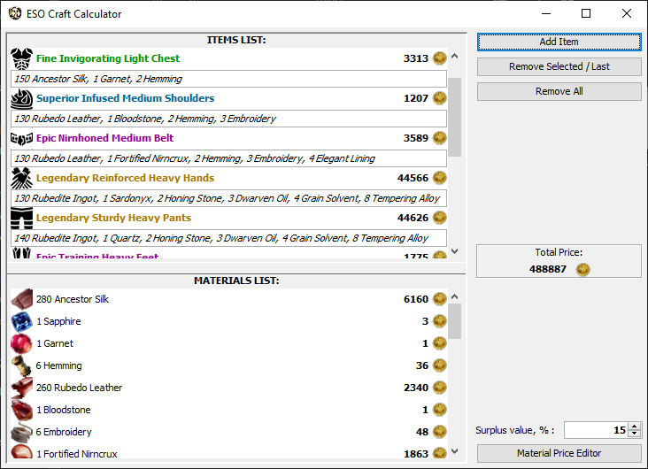
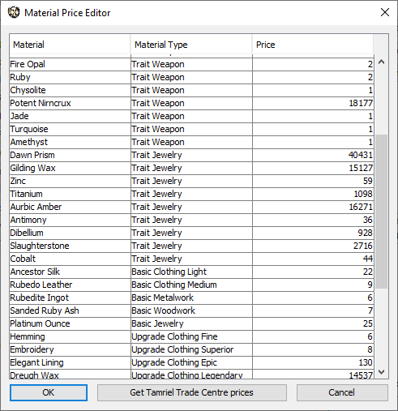
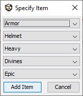
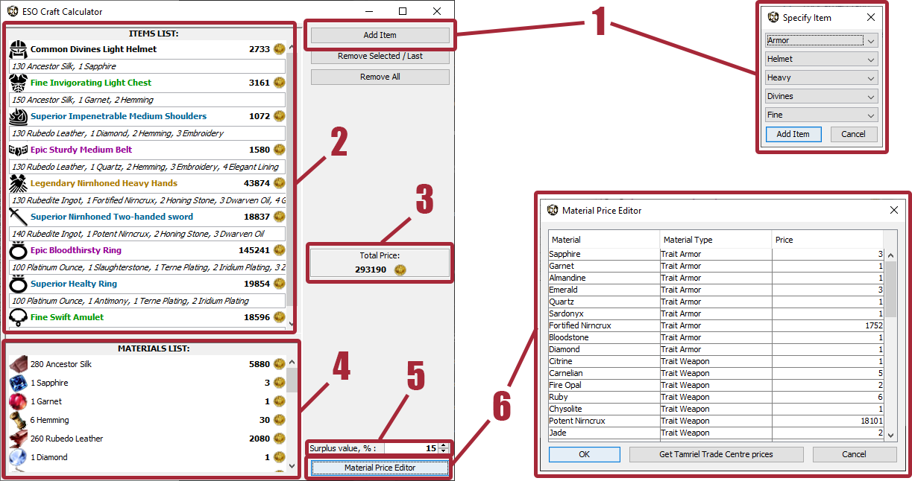
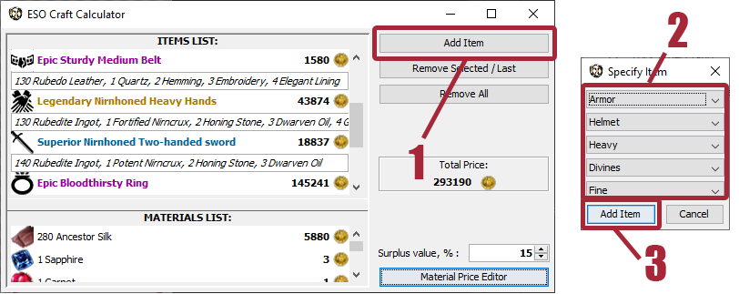
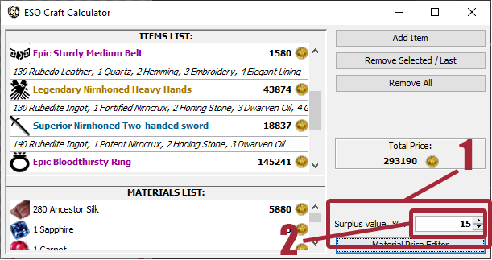
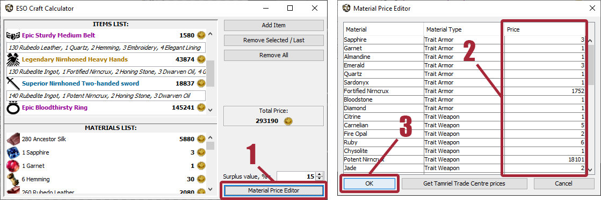

# Elder Scrolls Online Craft Calculator
**ESOCC** *(Elder Scrolls Online Craft Calculator)* – is a small standalone craft calculator application for The Elder Scrolls Online game used to calculate total price of the list of items based on the required materials’ price and surplus value. Works best with Tamriel Trade Centre (median material prices can be imported), but it is not mandatory.

## Features:
- Easy to use UI.
- Dynamically created list of required materials (based on added items), for use as shopping list.
- Editable database of materials’ prices.
- Ability to update material’s price list with Tamriel Trade Centre prices.
- Manual set of surplus value.

## Requirements: 
[Java Runtime Environment 8](https://java.com/en/download/manual.jsp)

## Installation:
1. Download the [latest version](https://drive.google.com/drive/folders/1dtx2jaPJYjnRe9dKoPUKaO5lHIQASZlu?usp=sharing)
2. Extract contents of the zip file (*ESOCC.exe* and *ESOCC.s3db*) somewhere. 
3. That is it! To use the program run ESOCC.exe.
> *ESOCC.exe* requires *ESOCC.s3db* database to work, so you should keep them in the same folder.

# Screenshots

  

# FAQ and UI instructions

## Base elements: 
  1. Item constructor – define your item on adding to the list by selecting its type, class, trait, quality.
  2. Items List – displaying currently added items with all required resources (material and quantity) and total price (based on required materials’ cost).
  3.Total Price – automatically calculates total price based on items’ prime cost and surplus value.
  4. Materials List – displaying all materials required to produce all items in Items list: initial material, its quantity and total cost based on material’s price (changeable in Material Price Editor)
  5. Surplus Value  – sets the desired surplus value (in %), which takes place in Total Price calculation. 0% means that total price will be just the prime cost.  
  6. Material Price Editor – edit the price of each material by yourself or load suggested prices from the Tamriel Trade Centre Add-on’s price list.

## FAQ:
### How to add item to the list:
  1. Click the Add Item button.
  2. Specify the Item by selecting its parameters (type, slot, trait, quality).
  3. Click the dialog’s Add Item button.

### How to show prime cost as Total Price:
  1. Go to surplus value spinner.
  2. Set manually or click arrow down to 0.
  > With 0% surplus value total price will only consist of item’s prime cost.

### How to edit materials’ prices:
  1. Click Material Price Editor button.
  2. Find needed material.
  3. Edit the value in the Price column for selected material’s string.
  4. Confirm the edits by clicking the OK button. 
  > Confirmed changes save to *ESOCC.s3db* database and will persist on the next program startup.

### How to upgrade material prices with prices from Tamriel Trade Centre:
  > Loading TTC prices means setting app’s materials’ prices to suggested (median) materials’ prices from TTC’s price list.
  
  ***If you have Tamriel Trade Centre ESO add-on installed:***
  1. Open explorer and go to
*C:\Users\YOUR USERNAME\Documents\Elder Scrolls Online\live\AddOns\TamrielTradeCentre\Client*
  2. Run Client.exe to update TTC price table.
  3. Go back to ESO Craft Calculator.
  4. Click Material Price Editor button.
  5. Click Get Tamriel Trade Center prices button.
  6. In the appeared explorer window go to 
  /Documents/Elder Scrolls Online/live/AddOns/TamrielTradeCentre
  and select PriceTable.lua file.
  7. Click Open button.
  *If you selected the right file you will see the dialog showing number of successfully updated materials, click OK to continue*
  8. Confirm new prices by pressing OK in Material Price Editor window. 
  > Confirmed changes save to *ESOCC.s3db* database and will persist on the next program startup.

  ***If you do*** **NOT** ***have Tamriel Trade Centre ESO add-on installed:***
  1. Go to [Tamriel Trade Centre official website](https://tamrieltradecentre.com/)
  2. Select your server (EU/US) and your platform (PC/XBOX/PS)
  3. Click on Addon button and select Web Client (Beta)
  4. Download Price Table
  5. Extract downloaded PriceTable.zip somewhere
  6. Go back to ESO Craft Calculator.
  7. Click Material Price Editor button.
  8. Click Get Tamriel Trade Center prices button.
  9. In the appeared explorer window go to the directory where you extracted files from PriceTable.zip on step 5 and select PriceTable.lua file.
  10.	Click Open button.
  > If you selected the valid file you will see the dialog showing number of successfully updated materials, click OK to continue
  11.	Confirm new prices by pressing OK in Material Price Editor window.
  > Confirmed changes save to *ESOCC.s3db* database and will persist on the next program startup.
